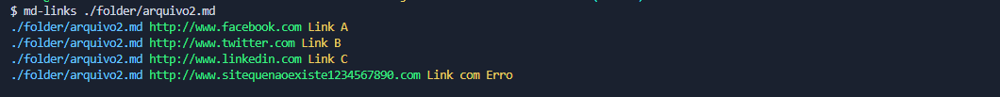
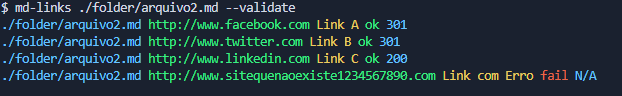
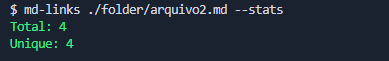
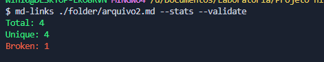
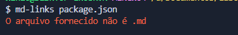
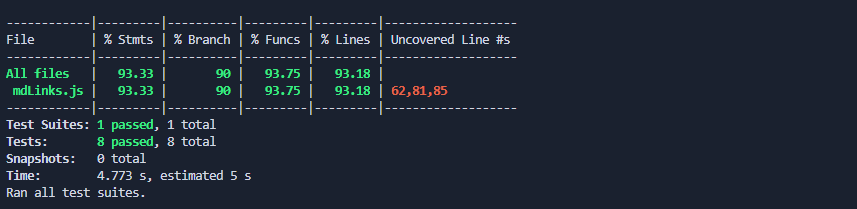

# Markdown Links 📚

Bem-vinda ao projeto Markdown Links! Este módulo JavaScript permite analisar arquivos Markdown (extensão .md) em busca de links e fornecer informações sobre eles, como a URL, o texto associado e o status de validação. 🌐📄

## Índice 📑

1. [Instalação](#1-instalação) 🚀
2. [Uso](#2-uso) 🛠️
3. [Documentação da API](#3-documentação-da-api) 📖
4. [Exemplos](#4-exemplos) 💡
5. [Testes](#5-testes) 🧪
6. [Contato](#6-contato) 📧

## 1. Instalação 📦

Para utilizar o `Markdown Links` em sua máquina, siga as seguintes etapas:

1. Certifique-se de ter o Node.js instalado em sua máquina. Caso não tenha, você pode fazer o download e a instalação em [nodejs.org](https://nodejs.org/). 📦

2. Abra o terminal e execute o seguinte comando para instalar o módulo via npm:

npm install -g md-links-lauradefreitas
Depois de instalar o módulo, você pode usá-lo com o seguinte comando:

md-links-lauradefreitas seu-arquivo.md
## 2. Uso 🛠️
Após a instalação, você pode usar o Markdown Links da seguinte maneira:

md-links-lauradefreitas seu-arquivo.md
Opções 🛠️
--validate - Verificar a validade dos links. ✅❌
--stats - Exibir estatísticas dos links encontrados. 📊
Exemplo:

md-links-lauradefreitas seu-arquivo.md --validate
## 3. Documentação da API 📖
O módulo Markdown Links fornece uma API simples com as seguintes funções:

mdLinks(filePath, options): Analisa um arquivo Markdown e retorna uma lista de links. Pode opcionalmente verificar a validade dos links ou fornecer estatísticas.

readMarkdownFile(filePath): Lê o conteúdo de um arquivo Markdown.

validateLink(link): Valida um link, verificando seu status de resposta.

normalizeURL(url): Normaliza uma URL, adicionando "http://" se ausente.

## 4. Exemplos 💡
Aqui estão alguns exemplos de como usar o módulo:

Listar todos os links em um arquivo:

 
md-links-lauradefreitas seu-arquivo.md --validate
Obter estatísticas dos links em um arquivo:

 

md-links-lauradefreitas seu-arquivo.md --stats

 

Verificar a validade dos links e obter estatísticas dos links em um arquivo:
md-links-lauradefreitas seu-arquivo.md --validate --stats

 

Verifica se é um arquivo .md:

 

## 5. Testes 🧪

 

## 6. Contato 📧
Você pode entrar em contato comigo em:

👩‍💻 Laura de Freitas - [LinkedIn](https://www.linkedin.com/in/lauradefreitas/) | [GitHub](https://github.com/lauradefreitas2) 